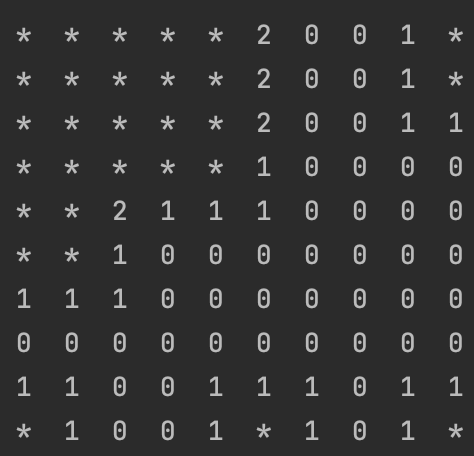

# 지뢰 찾기



## 1. 맵 초기화 및 지뢰 생성

### 1.1 맵 초기화

* 10x10의 2차원 배열 생성
* 배열의 원소는 각 위치의 상태를 표현하는 **Block 클래스**
  * state: 주위 지뢰의 숫자 및 지뢰여부(지뢰일 경우 '@')에 대한 문자를 표현
  * blockState: 해당 위치를 열었나 닫았나를 표현 (OPEN, CLOSE)
  * marker: 해당 위치가 지뢰라고 생각하고 마킹을 하는 것에 대한 표현

### 1.2 랜덤 포지션에 지뢰 생성 및 블록 상태값 업테이드

* Math.random을 사용한 x, y를 각각 생성 후 1.1에서 생성한 Block에 적용
* 이미 지뢰가 존재하는 위치에 중복생성 된다면 다시 생성
* **지뢰 생성후 주위 블록의 출력 숫자(state)를 1씩 증가**
  * -1, 0, 1의 2중 반복문을 사용해 주위 8칸에 접근
  * 0, 0 일 경우 본인 자신이므로 수행안함

```java
for (int i = 0; i < NUM_OF_MINE; i++) {
    int x = (int) (Math.random() * WIDTH),
            y = (int) (Math.random() * HEIGHT);

    if (board[y][x].isMine()) {
        i--;
        continue;
    }

    board[y][x].setMine();

    // 지뢰 주위 8칸을 순회하며 표시될 숫자를 카운팅
    for (int h = -1; h <= 1; h++) {
        for (int w = -1; w <= 1; w++) {

            // 자기 자신 제외
            if (h == 0 && w == 0) {
                continue;
            }

            // 유효한 위치일 경우
            if (isValidPos(x + w, y + h) && !board[y + h][x + w].isMine()) {
                board[y + h][x + w].incState();
            }
        }
    }
}
```

## 2. 게임플레이

* x y 기반의 위치를 입력
  * 각 위치는 0~9
* x y @ 의 경우 해당 위치에 마킹수행

## 3. 지뢰 탐색

* 지뢰 탐색을 위해 선택한 위치로 부터 지뢰정보(주위에 지뢰가 존재)가 표기되는 칸 까지 **재귀호출** 수행
  * 탐색을 시작하는 위치에 지뢰가 존재하면 **게임 패배**
  * 탐색을 위한 주위 8칸에 재귀호출
    * 해당 위치가 유효하지 않은 위치이면 재귀호출 종료
    * 0보다 큰 숫자를 가진 상태값이 발견되면 재귀호출 종료
    * 이미 발견한 위치라면 탐색 중지
    * 위 조건에 아무것도 해당하지 않으면 주위 8칸에 대한 재귀호출

### 유저턴에 대한 수행 메소드

```java
public GameState step(int x, int y){
    if(isMine(x, y)){
        return GameState.LOSE;
    }

    open(x, y);

    if(isGameWin()){
        return GameState.WIN;
    }

    return GameState.CONTINUE;
}
```

### 재귀호출 기반의 탐색

```java
private void open(int x, int y) {
    if (!isValidPos(x, y)) return;

    if (board[y][x].isOpen()) return;

    board[y][x].toOpen();

    if(board[y][x].isMineAtNear()) return;

    for (int h = -1; h <= 1; h++) {
        for (int w = -1; w <= 1; w++) {
            if (h == 0 && w == 0) continue;
            open(x + w, y + h);
        }
    }
}
```

## 4. 승리 여부 판단

* 탐색을 위한 재귀호출이 완료된후 게임 승리 여부 판단
  * 지뢰가 아닌 모든 위치가 열였다고 판단되면 게임승리
  * 아니면 게임 계속

```java
private boolean isGameWin() {
    for (int h = 0; h < HEIGHT; h++) {
        for (int w = 0; w < WIDTH; w++) {
            if (!board[h][w].isMine() && !board[h][w].isOpen()) {
                return false;
            }
        }
    }
    return true;
}
```
